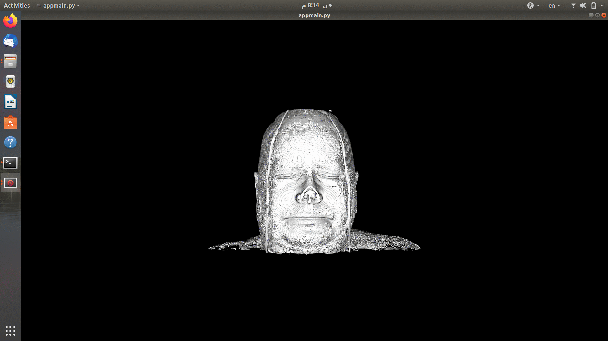
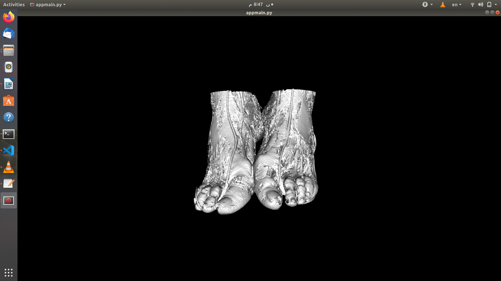
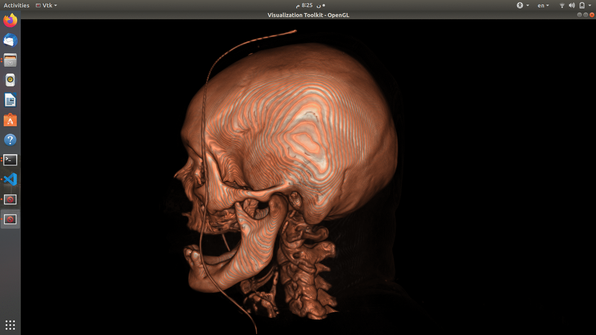
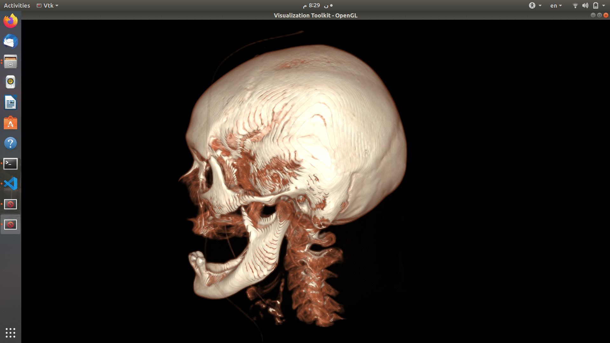

# Medical Visualization


using vtk and Qt to show DICOM data
```cpp
import vtk
import sys
import os
from PyQt5 import QtWidgets

```
import main window of the GUI from renderapp
```cpp
from renderapp import Ui_MainWindow

```
reading DICOM from directory
```cpp

    def load(self):
        dataDir = QFileDialog.getExistingDirectory(self, 'Choose DICOM Directory') + '/'
        print(dataDir)
        return dataDir 

    def DICOMREADER(self):
        # Read Dataset using vtkDICOMReader
        dataDir = self.load()
        self.reader = vtk.vtkDICOMImageReader()
        self.reader.SetDirectoryName(dataDir)
        print(dataDir)
        self.reader.Update()
```


# connect slider with the surface extractor
set iso value to slider value 

```cpp
    def slider_SLOT(self,val):
        self.iren = QVTKRenderWindowInteractor() 
        self.surfaceExtractor.SetValue(0, val)
        self.iren.update()
```

# Choose Mode From comboBox

```cpp

def Rendering_Mode(self):
        print(self.ui.comboBox.currentIndex())
        if self.ui.comboBox.currentIndex() == 1:
            self.vtk_surface_rendering()

        elif self.ui.comboBox.currentIndex() == 2:
            self.vtk_rayCasting()
     
```


## Surface Rendering Function
*show layer by layer according to the ISO value*
*surface extraction*



```cpp
 def vtk_surface_rendering(self):
        self.iren = QVTKRenderWindowInteractor()  
        self.renWin = self.iren.GetRenderWindow()
        aRenderer = vtk.vtkRenderer()
        self.renWin.AddRenderer(aRenderer)

        self.surfaceExtractor.SetInputConnection(self.reader.GetOutputPort())
        self.surfaceExtractor.SetValue(0, 0.0)
        surfaceNormals = vtk.vtkPolyDataNormals()
        surfaceNormals.SetInputConnection(self.surfaceExtractor.GetOutputPort())
        surfaceNormals.SetFeatureAngle(60.0)
        surfaceMapper = vtk.vtkPolyDataMapper()
        surfaceMapper.SetInputConnection(surfaceNormals.GetOutputPort())
        surfaceMapper.ScalarVisibilityOff()
        
        surface = vtk.vtkActor()
        surface.SetMapper(surfaceMapper)
```
*camera setting*
```cpp
        aCamera = vtk.vtkCamera()
        aCamera.SetViewUp(0, 0, -1)
        aCamera.SetPosition(0, 1, 0)
        aCamera.SetFocalPoint(0, 0, 0)
        aCamera.ComputeViewPlaneNormal()
        
        aRenderer.AddActor(surface)
        aRenderer.SetActiveCamera(aCamera)
        aRenderer.ResetCamera()
        aCamera.Dolly(1)
        
        aRenderer.SetBackground(0, 0, 0)
        self.renWin.SetSize(640, 480)
        aRenderer.ResetCameraClippingRange()
```
*show and interact with data*
```cpp  
        # Interact with the data.
        self.iren.Initialize()
        self.renWin.Render()
        self.iren.Start()
        self.iren.show()

```
# ray casting Volune Rendering

the volume mapper take its data from reader to start rendering
```cpp
  def vtk_rayCasting(self):
       
        ren = vtk.vtkRenderer()
        renWin = vtk.vtkRenderWindow()
        renWin.AddRenderer(ren)
        self.iren = vtk.vtkRenderWindowInteractor()
        self.iren.SetRenderWindow(renWin)
        
        volumeMapper = vtk.vtkGPUVolumeRayCastMapper()
        volumeMapper.SetInputConnection(self.reader.GetOutputPort())
        volumeMapper.SetBlendModeToComposite()

```
set RGB colour for each surface


```cpp
        volumeColor = vtk.vtkColorTransferFunction()
        volumeColor.AddRGBPoint(0,    0.0, 0.0, 0.0)
        volumeColor.AddRGBPoint(500,  1.0, 0.0, 0.3)
        volumeColor.AddRGBPoint(1000, 1.0, 0.5, 0.3)
        volumeColor.AddRGBPoint(1150, 1.0, 1.0, 0.9)

```
set the obacity of each colour 


```cpp
        volumeScalarOpacity = vtk.vtkPiecewiseFunction()
        volumeScalarOpacity.AddPoint(0,    0.00)
        volumeScalarOpacity.AddPoint(500,  0.15)
        volumeScalarOpacity.AddPoint(1000, 0.15)
        volumeScalarOpacity.AddPoint(1150, 0.85)
        
        volumeGradientOpacity = vtk.vtkPiecewiseFunction()
        volumeGradientOpacity.AddPoint(0,   0.0)
        volumeGradientOpacity.AddPoint(90,  0.5)
        volumeGradientOpacity.AddPoint(100, 1.0)

```
set the volume rendering properties 
```cpp 
      
        volumeProperty = vtk.vtkVolumeProperty()
        volumeProperty.SetColor(volumeColor)
        volumeProperty.SetScalarOpacity(volumeScalarOpacity)
        volumeProperty.SetGradientOpacity(volumeGradientOpacity)
        volumeProperty.SetInterpolationTypeToLinear()
        volumeProperty.ShadeOn()
        volumeProperty.SetAmbient(0.4)
        volumeProperty.SetDiffuse(0.6)
        volumeProperty.SetSpecular(0.2)

        volume = vtk.vtkVolume()
        volume.SetMapper(volumeMapper)
        volume.SetProperty(volumeProperty)

       
        ren.AddViewProp(volume)

```
set the camera

```cpp

        camera =  ren.GetActiveCamera()
        c = volume.GetCenter()
        camera.SetFocalPoint(c[0], c[1], c[2])
        camera.SetPosition(c[0] + 500, c[1], c[2])
        camera.SetViewUp(0, 0, -1)

        renWin.SetSize(640, 480)

```
 Interaction with the data.


```cpp
        self.iren.Initialize()
        renWin.Render()
        self.iren.Start()

```# MedicalVisualisation-GUI-using-VTK
